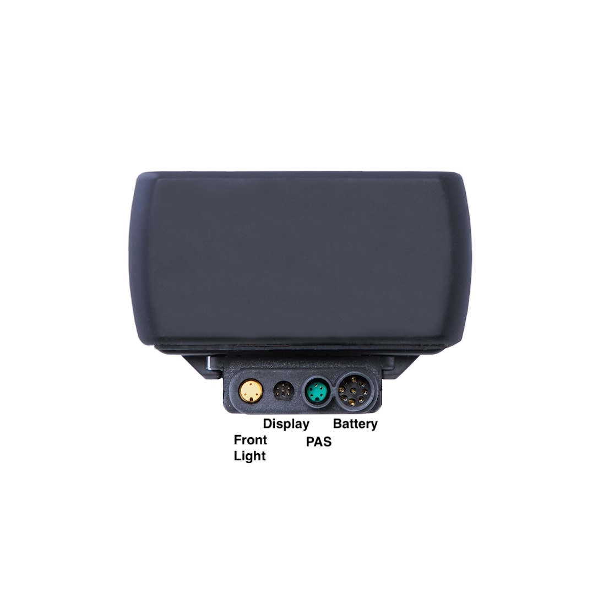

# Fact sheet
## Overview
This is some information that I gathered from multiple sources on the bike and controller. Some of it is not listed anywhere, so I hope it will be helpful to others.

## Controller
36V 250 watt I believe square wave controller.

Connectors:

Yellow 3 pin - front light

Black 6 pin - display

Green 5 pin - PAS

Black 9-pin motor connector

## Battery
Promovec battery 36V 10S

## Motor
3 phase with built-in haul sensors, including speed. Not sure about temperature yet.

## PAS
At this point I'm not sure whether it is just cadence sensor or it has some torque output. Typical cadence sensors use 3 pins, this sensor uses 5 pins. I don't know whether all 5 pins are used.  
